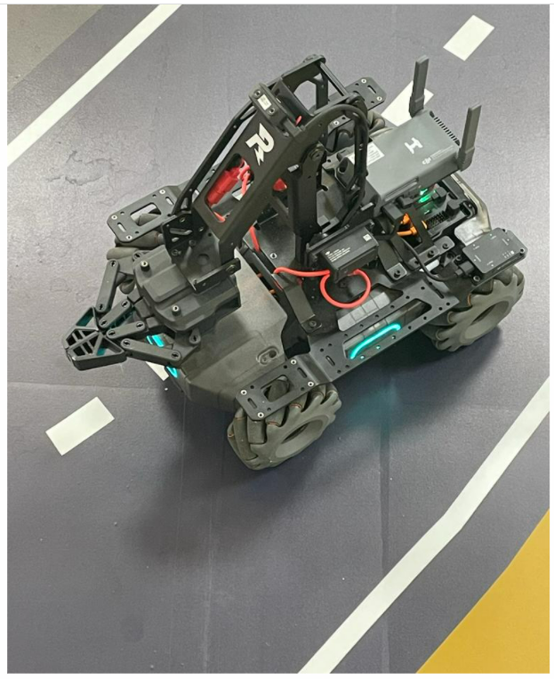

# MobileRobot-Openloopcontrol
## Aim:

To develop a python control code to move the mobilerobot along the predefined path.

## Equipments Required:
1. RoboMaster EP core
2. Python 3.7

## Procedure

Step1:

Start

Step2:

From robomaster import robot


Step3:

Intialize the type


Step4:

Run the program to move the robo master through our condition

step5:

end


## Program

Developded by: P.Ramsai

Reference no: 21000888
```python
from robomaster import robot
import time

if __name__ == '__main__':
    ep_robot = robot.Robot()
    ep_robot.initialize(conn_type="ap")

    ep_chassis = ep_robot.chassis

    from robomaster import robot
import time

if _name_ == '_main_':
    ep_robot = robot.Robot()
    ep_robot.initialize(conn_type="ap")

    ep_chassis = ep_robot.chassis

    from robomaster import robot
import time

if _name_ == '_main_':
    ep_robot = robot.Robot()
    ep_robot.initialize(conn_type="ap")

    ep_chassis = ep_robot.chassis
    ep_led = ep_robot.led

    ep_chassis.move(x=2, y=0, z=0, xy_speed=0.75).wait_for_completed()
    ep_chassis.move(x=0, y=0, z=90, xy_speed=1).wait_for_completed()
    ep_led.set_led(comp="all",r=255,g=69,b=0,effect="on")  
    ep_chassis.move(x=2, y=0, z=0, xy_speed=0.75).wait_for_completed()
    ep_chassis.move(x=0, y=0, z=90, xy_speed=0.75).wait_for_completed()
    ep_led.set_led(comp="all",r=255,g=255,b=255,effect="on")
    ep_chassis.move(x=2, y=0, z=0, xy_speed=0.75).wait_for_completed()
    ep_chassis.move(x=0, y=0, z=90, xy_speed=0.75).wait_for_completed()
    ep_led.set_led(comp="all",r=19,g=136,b=8,effect="on")
    ep_chassis.move(x=2, y=0, z=0, xy_speed=0.75).wait_for_completed()
    ep_chassis.move(x=0, y=0, z=90, xy_speed=0.1).wait_for_completed()
    ep_chassis.move(x=0, y=0, z=45, xy_speed=0.1).wait_for_completed()
    ep_chassis.move(x=1.5, y=0, z=0, xy_speed=0.75).wait_for_completed()
    ep_chassis.drive_speed(x=0.4,y=0,z=20)
    time.sleep(20)
    ep_chassis.drive_speed(x=0,y=0,z=0)
    print("Completed...")
    ep_robot.close()


    
    ep_robot.close()


    
    ep_robot.close()
```

## MobileRobot Movement Image:





<br/>
<br/>
<br/>
<br/>

## MobileRobot Movement Video:

https://www.youtube.com/watch?v=TLKPUdjDF1o

<br/>
<br/>
<br/>
<br/>

## Result:
Thus the python program code is developed to move the mobilerobot in the predefined path.


<br/>
<br/>

```
Mobile Robotics Laboratory
Department of Artificial Intelligence and Data Science/ Machine Learning
Saveetha Engineering College
```
